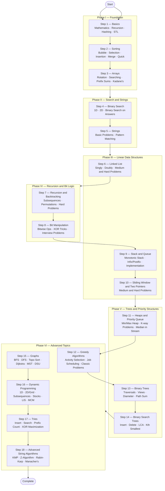
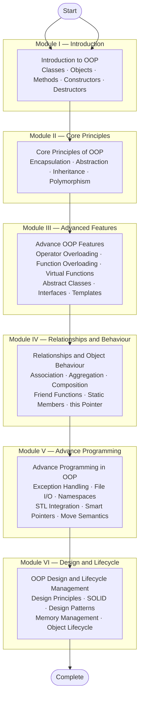

# Data Structures, Algorithms and Object-Oriented Programming

A structured, progressive implementation of Data Structures, Algorithms, and Object-Oriented Programming concepts in C++.  
The repository covers two parallel tracks — a complete DSA learning path progressing from mathematical fundamentals to advanced algorithmic problem solving, alongside a thorough study of OOP from core principles to design patterns and lifecycle management.

---

## DSA Learning Roadmap

The flowchart below represents the complete DSA learning path followed in this repository, progressing through 18 well-defined steps across foundational, intermediate, and advanced topics.



---

## Object-Oriented Programming Roadmap

The flowchart below represents the complete OOP learning path covered in this repository, progressing through 6 modules from foundational class concepts to advanced design and lifecycle management.



---

## OOP Topics at a Glance

| Module | Topic | Key Concepts |
|--------|-------|--------------|
| 1 | Introduction to OOP | Classes, objects, methods, constructors, destructors, access specifiers |
| 2 | Core Principles of OOP | Encapsulation, abstraction, inheritance (single/multi/hierarchical), polymorphism |
| 3 | Advance OOP Features | Operator overloading, function overloading, virtual functions, abstract classes, templates |
| 4 | Relationships and Object Behaviour | Association, aggregation, composition, friend functions, static members, `this` pointer |
| 5 | Advance Programming in OOP | Exception handling, file I/O, namespaces, STL integration, smart pointers, move semantics |
| 6 | OOP Design and Lifecycle Management | SOLID principles, design patterns (creational/structural/behavioural), memory management |

---

## DSA Topics at a Glance

| Step | Topic | Key Concepts |
|------|-------|--------------|
| 1 | Basics | Digit operations, prime checking, GCD/LCM, Armstrong numbers, recursion, hashing, STL |
| 2 | Sorting | Bubble, selection, insertion, merge, quick, counting sort |
| 3 | Arrays | Rotation, prefix sums, Kadane's algorithm, majority element, union, missing number |
| 4 | Binary Search | Classic search, search in 2D matrix, binary search on answer space |
| 5 | Strings | Reverse, palindrome, anagram, longest substring, pattern matching |
| 6 | Linked List | Reversal, cycle detection, merge sorted lists, remove Nth node, intersection |
| 7 | Recursion and Backtracking | Subsets, permutations, N-Queens, Sudoku solver, word search |
| 8 | Bit Manipulation | Bitwise operators, XOR tricks, set/clear/toggle bits, power checks |
| 9 | Stack and Queue | Monotonic stack, stock span, infix/postfix/prefix conversion, LRU cache |
| 10 | Sliding Window and Two Pointers | Max sum subarray, longest window, trapping rain water, container problems |
| 11 | Heaps and Priority Queue | Min/Max heap, Kth largest, merge K sorted lists, median in a stream |
| 12 | Greedy Algorithms | Activity selection, job scheduling, fractional knapsack, minimum platforms |
| 13 | Binary Trees | Level order, zigzag traversal, LCA, diameter, maximum path sum, views |
| 14 | Binary Search Trees | Insert, delete, search, validate BST, Kth smallest, construct from traversals |
| 15 | Graphs | BFS, DFS, topological sort, Dijkstra, Bellman-Ford, Prim, Kruskal, Disjoint Set Union |
| 16 | Dynamic Programming | 1D DP, 2D/Grid DP, subsequences, strings, stocks, LIS, Matrix Chain Multiplication |
| 17 | Tries | Insert, search, delete, prefix count, XOR maximization |
| 18 | Advanced String Algorithms | KMP algorithm, Z-algorithm, Rabin-Karp hashing, Manacher's algorithm |

---

## Repository Structure

```
DSA/
├── 1. Basics/
├── 2. Sorting/
├── 3. Arrays/
├── 4. Binary Search/
├── 5. Strings/
├── 6. Linked List/
├── 7. Recursion/
├── 8. Bit Manipulation/
├── 9. Stack and Queue/
├── 10. Sliding Window/
├── 11. Heaps/
├── 12. Greedy/
├── 13. Binary Trees/
├── 14. Binary Search Trees/
├── 15. Graphs/
├── 16. Dynamic Programming/
├── 17. Tries/
├── 18. Advanced Strings/
└── Object Oriented Programming/
```

---

## Getting Started

### Prerequisites

- C++ compiler — GCC 9 or later (MinGW on Windows)
- Any terminal: PowerShell, bash, zsh, Command Prompt

### Compile and Run

**Linux / macOS**
```bash
g++ filename.cpp -o output
./output
```

**Windows**
```powershell
g++ filename.cpp -o output
.\output.exe
```

**Windows — Policy-Restricted Environments**  
If execution is blocked by an application control policy, compile the output to the system temp directory:
```powershell
g++ filename.cpp -o "$env:TEMP\output" ; & "$env:TEMP\output"
```

---

## Current Progress

### Data Structures and Algorithms

| Step | Topic | Status |
|------|-------|--------|
| 1 | Basics | In Progress |
| 2 | Sorting | In Progress |
| 3 | Arrays | In Progress |
| 4 — 18 | Binary Search through Advanced Strings | Upcoming |

### Object-Oriented Programming

| Module | Topic | Status |
|--------|-------|--------|
| 1 | Introduction to OOP | In Progress |
| 2 — 6 | Core Principles through Design and Lifecycle | Upcoming |

---

## Language

All implementations are written in **C++**.
